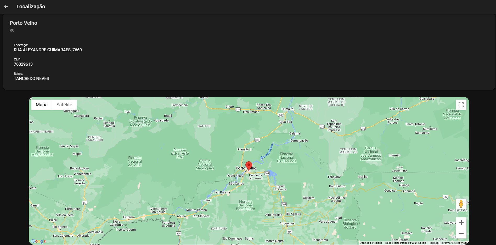

# School List App

## Overview

This application was created as a learning project for Angular and the Ionic Framework. It utilizes a public API to display a list of Brazilian schools along with their information, contact details, and geographic locations.

## Prerequisites

To test, make sure you have the following installed:

- Node.js and npm
- Angular CLI
- Ionic CLI
- Typescript

## Getting Started
1. Clone this repository to your local machine:

   ```bash
   git clone https://github.com/ftm2-cin/school-list.git
   ```

2. Navigate to the project directory:

   ```bash
   cd school-list
   ```

3. Install project dependencies:
   ```bash
   npm install
   ```
4. Start the development server:
   ```bash
   ionic serve
   ```

## Features
1. Responsive UI
2. API Integration
3. Google Maps Integration API (API Key Free period ends in February - 2024)
   
   

5. Testing
6. Performance Optimization:
   - Optimize API Calls: Minimize network latency and enhance performance by employing caching strategies or batching API requests.
7. Accessibility and Localization:
8. Local Storage
9. Documentation
